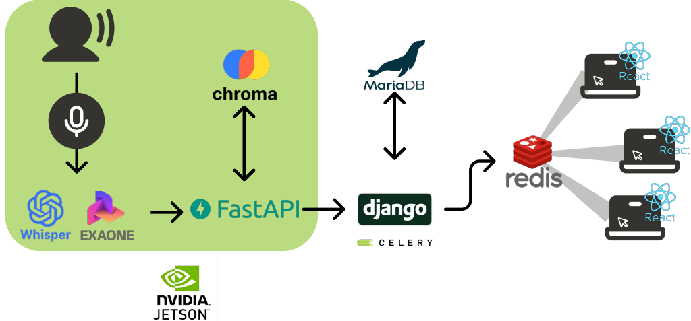
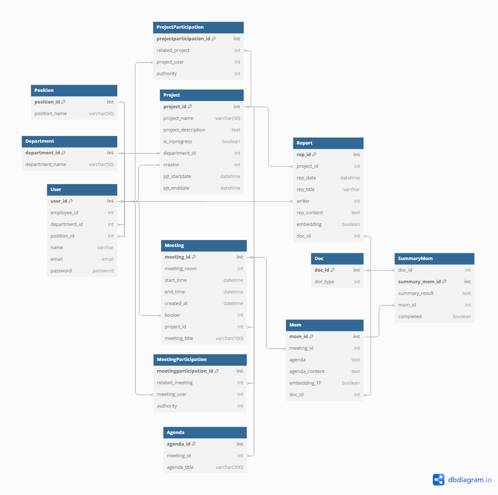

# MeetGenius
[소개 영상]


## 💡 개요
- 진행기간 : 2025.01.06 ~ 2025.02.21.
- 주제 :  온디바이스 AI 회의 비서
- 서비스명 : MeetGenius
- 설명 : 
    - **MeetGenius**는 유저 관리부터 프로젝트 생성 및 관리, 관련 문서추가, 회의 예약 및 관리 기능을 제공합니다.
    - MeetGenius는 **음성 데이터를 기반으로 회의를 실시간 처리**하며, **RAG 기반으로 관련 문서를 검색해 답변을 제공**하는 구조를 갖고 있습니다.
.

  
|   팀원    | 역할 |
|--------|-------|
|정찬호| PM, Infra, Data|
|박가연| Data, AI engineering|
|연재환| aI engineering, Prompt Engineering, Back-end 개발 (Fast API)|
|김근휘| Back-end 개발(Django, Fast API)|
|장인영| Back-end 개발(Django), Front-end 개발(React.js)|
|정유진| Front-end 개발(React.js), Design(Figma)|

<br>

##  ⚙️ 기술 스택
### Frontend


### Backend


### AI/Data


### Infra


### Environment


<br>

## ❗ 기획 배경
### 사용자 페인 포인트 및 니즈

1. **보안성**
    - 페인포인트: 최근 기업 기밀정보의 외부 유출 사례가 증가하면서, 클라우드 서버 의존 시 보안 취약점(물리·네트워크·시스템 등)이 발생할 가능성이 높음.
    - 니즈: 기업 내부망(온프레미스)에서 데이터를 처리하여 기밀정보를 안전하게 보호하고, 보안 리스크를 최소화할 수 있는 솔루션 필요.
      
2. **비효율적인 회의 운영**
    - 페인포인트: 회의록 작성, 관련 문서 탐색, 회의 내용 정리 등의 단순 반복 업무가 많아 비효율적임.
    - 니즈: 프로젝트 및 회의 정보를 한곳에서 통합 관리하고, 회의 생산성을 높이는 자동화 솔루션 필요.

### 서비스

1. **보안 강화**
    - Jetson Orin 보드를 활용한 온디바이스 AI 회의 비서를 제공하여, 모든 데이터가 내부망에서 처리되도록 보장함.

2. **효율적인 회의 운영**
    - 반복적인 회의 기록 및 회의록 작성 업무를 자동화하여 회의 생산성을 극대화함.
    - 프로젝트와 회의 정보를 통합 관리하여 불필요한 업무를 줄이고, 실질적인 논의에 집중할 수 있도록 지원함.

3. **실시간 정보 활용**
    - 회의 도중 필요한 문서를 신속하게 검색하고, 특정 키워드(STT)을 트리거로 관련 정보를 즉시 제공하여 의사결정 속도와 정확성을 향상함.
    - 회의 중 생기는 이슈나 과제에 대해 즉각적인 판단을 내릴 수 있도록 지원함.

4. **STT 기술 결합으로 사용성 제공**
    - 실시간 음성인식(STT) 기술을 활용하여 회의 내용을 자동으로 텍스트로 변환함.
    - 이를 통해 회의록 작성 시간을 줄이고, 기록된 내용을 쉽게 검색 및 분석할 수 있도록 함.


## **📌 설계 및 개발 시 집중한 요소**

### **1. 온디바이스 AI 경량화 (Jetson Orin)**
- AIOT 환경(**Jetson Orin nano**)에서 AI 작업을 처리해야 했음 : Ram 용량이 한정적
- AI 모델의 **경량화**를 통해 **실시간 STT, 문서 검색, 회의록 요약 속도 및 정확도 최적화**  
---

### **2. 실시간 회의 데이터 동기화 (Redis + SSE)**
- 모든 회의 참여자가 **동일한 회의 화면**을 볼 수 있도록 **Redis Pub/Sub + SSE(Server-Sent Events) 기반 동기화 구현**  
- 모든 회의 내용을 적절한 Key값을 활용해 **Redis에 저장 및 Publish**, 프론트엔드는 **SSE를 활용하여 실시간 수신**  
- **Django에서 Redis를 활용한 중계 역할** 수행  
    - **발언 내용 및 STT → FastAPI → Django → Redis → Web(React)로 실시간 전파**  

---

### **3. DB 최적화 및 대용량 문서 검색 속도 개선**
- **프로젝트, 회의, 문서 데이터 간의 관계 최적화**  
- **select_related()** 사용을 통한 **N+1 문제 해결 및 DB 조회 성능 향상**  
- 벡터 DB(ChromaDB)와 관계형 DB(MariaDB)의 조합을 활용하여 **대용량 문서 검색 성능 최적화**  
    - **벡터 검색을 먼저 수행(유사한 문서 ID 획득) → MariaDB에서 상세 문서 정보 조회**  

---

### **4. AI 문서 분석 및 회의록 자동 생성**
- **LLM(EXAONE) + RAG 기반 문서 요약 및 분석**  
- STT(음성 데이터) → 회의록 초안 자동 생성 → AI가 요약하여 최종 회의록 완성  
- AI 회의록 요약 기능을 추가하여 **중요 발언만 정리 & 핵심 내용 강조**  

---


<br>

## 📄 설계 
### 아키텍처
 
 

### ERD
 

> ## **Git 전략**
> 
> ### **1. 브랜치 전략**
> - `master` : 배포용 브랜치  
> - `DEV/WEB`, `DEV/JETSON` : 개발용 브랜치 (모든 기능 브랜치는 여기서 파생)  
> - `feature/{기능명}` : 새로운 기능 개발  
> - `fix/{버그명}` : 버그 수정  
> - `hotfix/{긴급버그명}` : 긴급 버그 수정  
> - `chore/{기타작업}` : 설정 변경, 문서 수정 등  
>
> 모든 PR은 각각의 `DEV` 브랜치로 병합하며, 코드 리뷰를 필수로 진행합니다.
> 
> ---
>
> ### **2. 커밋 컨벤션**
> **📌 목적**
> 팀원 간 일관된 커밋 메시지를 유지하여 작업 내용을 쉽게 추적할 수 있도록 합니다.
> JIRA와 연동된 TASK를 커밋 메시지에 포함하여 업무 공유를 원활하게 진행합니다.
>
> **📌 커밋 메시지 형식**
> ```
> Type(Scope): 작업 내용 요약
> 
> 상세 설명 (필요하면 추가)
> 
> #이슈번호
> ```
> 
> **✅ 예시**
> ```
> feat(BE): 로그인 기능 추가
> 
> 유효성 검사를 모두 마친 로그인 기능 추가
> 
> #S12P11B203-16
> ```
>
> ---
>
> **📌 커밋 Type 정의**
> | Type      | 설명 |
> |-----------|----------------------------------------|
> | feat      | 새로운 기능 추가 |
> | fix       | 버그 수정 |
> | docs      | 문서 작업 (예: README 수정) |
> | style     | 코드 포맷팅, 세미콜론 누락 등 코드 스타일 수정 (기능 변화 없음) |
> | refactor  | 리팩토링 (기능 변경 없이 코드 구조 개선) |
> | test      | 테스트 추가/수정 |
> | chore     | 빌드 작업, 패키지 관리 등 기타 변경 사항 |
> 
> ---
>
> **📌 Scope 정의**
> | Scope  | 설명 |
> |--------|----------------------------|
> | FE     | 프론트엔드 관련 작업 |
> | BE     | 백엔드 관련 작업 |
> | AI     | 인공지능 관련 작업 |
> | DA     | 데이터 분석 관련 작업 |
> | EM     | 임베디드 관련 작업 |
> | ETC    | 기타 작업 |
> 
> ---


<br>

## 🖥️  서비스 대표 기능

> - **실시간 STT 기반 회의록 생성**  
> - **Redis 기반 다중 사용자 동기화**  
> - **회의 중 AI 비서(아리)에게 질문 가능**  
> - **프로젝트 단위 회의 관리 및 문서 탐색**  
> - **회의 요약 및 자동 보고서 생성**  

**1. 프로젝트 생성 & 문서 삽입**

- 프로젝트 생성: 프로젝트 이름, 내용, 참여자 목록을 입력하여 프로젝트 단위로 관리할 수 있음음
- 프로젝트 관련 문서 삽입: 문서는 Maria DB에 저장된 후 **Chroma DB에 벡터화**되어 저장 → **회의 중 AI 비서(아리)의 문서 탐색에 활용**  


 


**2. 회의 예약**
- 회의 예약: 프로젝트 참여자 목록을 자동으로 불러와 편리한 회의 설정
- 실시간 회의 페이지에서 안건과 관련된 문서를 확인할 수 있음


- 삭제 권한 제한: 마스터 및 참여자 권한에 따라 삭제가 제한되며, 참여자가 아닐 경우 삭제할 수 없음


   
**3. 실시간 회의 기록**
- 회의 내용을 기록하고, 실시간 회의 페이지에서 해당 내용을 제공
- **STT(음성 인식, Whisper Model) 기반 실시간 회의록 생성**  
- 회의 내용은 Redis를 통해 모든 사용자에게 동기화


**4. AI 비서(아리) 기반 자료 탐색**
- **회의 중 AI 비서(아리)에게 질문 가능**  
- **ChromaDB에서 관련 문서를 검색 후 AI 답변 제공**  
- **알고리즘**
    - **1. [FastAPI, Jetson] 문서 유사도 검사**
        - 문서 추가 시 함께 전달된 **메타데이터(문서 ID, 프로젝트 ID 등)**를 활용
        - 회의 안건과 유사한 문서를 **벡터DB(ChromaDB)**에서 검색
        - 유사도가 높은 상위 3개의 문서(Document IDs) 반환
    - **2. [Django, Web] 데이터 처리 및 Redis 전송**
        - 반환된 document_ids를 MariaDB에서 검색
        - 관련 문서를 Redis에 저장 및 SSE(Server-Sent Events)로 실시간 전송
    - **3. [React, Web] 해당 데이터 처리**
        - 웹 애플리케이션(React)에서 Redis의 SSE 스트림을 수신
        - 실시간으로 관련 문서를 화면에 표시


**5. 동일한 화면**
- 모든 사용자에게 동일한 회의 기록을 제공
- **회의 내용은 Redis를 통해 회의id별로 사용자(회의 참여자)에게 동기화**하여 참여 시점에 관계없이 회의 내용 확인 가능
- **알고리즘**
    - **Redis를 활용한 실시간 데이터 동기화**
        - 참고 문서(documents)
        - 안건 정보(agendas)
        - 현재 안건 정보(cur_agenda)
        - STT 데이터(STT_data)
        - 지난 안건 STT 데이터 (STT_history)
    - Django가 Redis Pub/Sub을 통해 데이터 전송, 프론트엔드는 SSE를 활용해 실시간 반영


**6. 회의록 생성**
- 회의 전체 내용을 확인하고 수정 가능
- 수정 후, AI 회의 비서가 회의록을 요약
- 회의 요약에는 약 10s 소요 (500자 미만)
- **알고리즘**
    1. Django에서 FastAPI에 요약 요청 (Celery 활용한 백그라운드 처리)
    2. FastAPI에서 전달받은 안건 별 회의록 내용 ChromaDB에 저장
    3. FastAPI에서 AI 모델을 통해 안건별로 회의록 내용 요약 후 반환
    4. Django가 받은 요약 결과를 MariaDB에 저장 후 프론트엔드에 전달달


<br>


<br>

## 소감
| 팀원     | 소감 |
|-----------|--------|
| 정찬호 🐨 | 마지막 2주가 너무 빡빡했습니다. 느리긴 했지만 결과적으로 성공적인 구현 및 시연을 해서 가장 보람 있었던 순간인 것 같습니다. 또한 웹단의 플로우를 잘 알지 못하고 시작한 점이 아쉬웠습니다. 팀장과 PM을 동시에 맡기에는 타 개발을 병행하기 어려운 느낌이 들었습니다. 도커 Desktop을 미리 설치하고, GitLab에 Docker 환경까지 설정해 개발자들이 바로 사용할 수 있도록 했으면 어땠을까 하는 생각이 들었습니다. |
| 박가연 🐥 | IoT 기술을 활용한 프로젝트는 처음이라 신기했고, 좋은 경험이었습니다. 웹과 Jetson 사이에서 주고받아야 하는 데이터의 변동 사항이 많아 어려웠지만, FastAPI로 엔드포인트를 작성하며 데이터 파이프라인을 구축하는 과정이 흥미로웠습니다. 데이터 담당을 맡았지만, 기술 지식의 한계를 많이 느꼈습니다. |
| 연재환 🤖 | ARM 아키텍처 기반의 Jetson Orin Nano 초기 세팅이 까다로웠으나, 공식 문서 및 GitHub Issue들을 확인하며 개발 환경을 성공적으로 구축한 점이 보람찼습니다. 또한, LLM 모델의 할루시네이션 원인(Lost in the Middle)을 분석하고 해결한 과정도 뜻깊었습니다. 마지막 주차에서 Jetson과 웹을 연결하는 과정에서 발생한 버그 해결과 Side-Effect 수정이 어려웠습니다. 다음 프로젝트에서는 파트 간 및 팀원 간 주기적인 소통과 진행 사항 공유, 유기적인 역할 분담에 더욱 힘써야겠다고 느꼈습니다. |
| 김근휘 🐶 | 명확한 설계 없이 개발을 진행하면서 중간에 코드를 엎어야 하는 상황이 발생했습니다. 급하게 재설계하여 위기를 넘기고 기능을 구현했지만, 설계의 중요성을 다시 한번 깨달았습니다. 스트리밍 기능을 구현할 때 소켓과 SSE, 폴링을 두고 고민했으며, 최소한의 비용으로 동일한 성능과 기능을 구현하는 데 성공하여 보람찼습니다. 다음 프로젝트에서는 **① 팀원들과 기획·설계·개발 모든 부분에서 동일한 이해도를 유지할 것, ② 기능이 겉보기에 동작한다고 코드 리뷰를 소홀히 하지 않을 것, ③ 설계 단계에서 구현 방법을 충분히 고민할 것**을 지키도록 하겠습니다. |
| 장인영 🐹 | 중간에 인력 부족으로 인해 프론트엔드 개발에 투입되었는데, 새로운 경험이라 재미있었습니다. 프론트 코드 리팩토링을 진행하며, 기존 기능에 영향을 주지 않으면서도 코드 간결화에 성공한 점이 보람 있었습니다. 다음 프로젝트에서도 백엔드를 맡게 되었으므로, 프론트엔드와의 데이터 서빙 방식을 고민하고, 통신 구조를 학습하며 더욱 효율적인 개발을 목표로 하겠습니다. 또한, 프로젝트의 목적에 적합한 기술을 찾아 적용하는 데 더욱 신경 쓰겠습니다. |
| 정유진 🐇 | (내용 추가 예정) |

