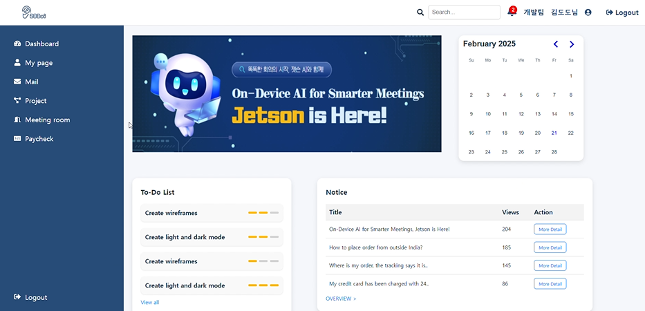

# MeetGenius
 


## 💡 개요
- 진행기간 : 2025.01.06 ~ 2025.02.21.
- 주제 :  온디바이스 AI 회의 비서
- 서비스명 : MeetGenius
  
|   팀원    | 역할 |
|--------|-------|
|정찬호| PM, Infra, Data|
|박가연| Data, AI engineering|
|연재환| aI engineering, Prompt Engineering, Back-end 개발 (Fast API)|
|김근휘| Back-end 개발(Django, Fast API)|
|장인영| Back-end 개발(Django), Front-end 개발(React.js)|
|정유진| Front-end 개발(React.js), Design(Figma)|

<br>

##  ⚙️ 기술 스택

### Frontend
   
     


### Backend
   
    
 

### AI/Data


  


### Infra
 


### Environment
       

<br>

## ❗ 기획 배경
### 사용자 페인 포인트 및 니즈

1. **단순 작업 반복 : 회의 기록**
    - 페인포인트: 회의기록, 관련 문서 탐색, 회의록 작성 업무 단순 작업 자동화
    - 니즈: 회의 중 관련 문서 탐색이 필요함.
      
2. **회의 중 관련 문서 탐색 : 회의 흐름 방해**
    - 페인포인트: 다양한 은행들의 금융 상품에 대한 정보들을 일일이 확인하고 비교하기 번거로움.
    - 니즈: 나와 유사한 사용자가 가입한 금융 상품은 무엇인지 알고 싶어함.

2. **단순 작업 반복 : 회의록 작성**
    - 페인포인트: 다양한 은행들의 금융 상품에 대한 정보들을 일일이 확인하고 비교하기 번거로움.
    - 니즈: 나와 유사한 사용자가 가입한 금융 상품은 무엇인지 알고 싶어함.

### 서비스 목적

1. ****
    -  
  
2. ****
    - 


<br>

## 📄 설계 
### 아키텍처
 

### ERD
 


<br>

## 서비스 대표 기능
**1. 프로젝트 생성 & 회의 예약**
   - 
   
   
**2. 회의 기록**
   - 
**3. 자료 탐색**
   - 

**4. 회의록 생성**
   - 
<br>

## 🖥️ 페이지 프리뷰
**1. 메인 페이지**


**2. 프로젝트 생성**


**3. 회의 예약**


**4. 회의 기록 (STT)**


**5. 자료 탐색 (RAG)**


**6. 회의록 생성**


   
<br>

## 🤖 알고리즘
**1. 실시간 회의 페이지 - SSE**
- 
  
**2. 회의 기록 - STT**
- 

```python

```

**3. 자료 탐색 - RAG**
- 

```python

```

**4. 회의록 생성- Summary**
- 

```python

```

<br>

<br>

## 소감
| 팀원     | 소감 |
|-----------|--------|
|정찬호 🐨| |
|박가연 🐥| |
|연재환 🤖| |
|김근휘 🐶| |
|장인영 🐹| |
|정유진 🐇| |