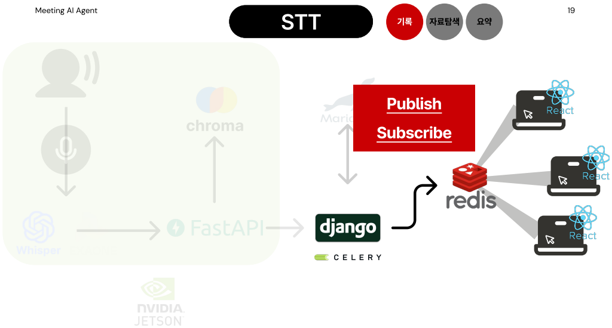
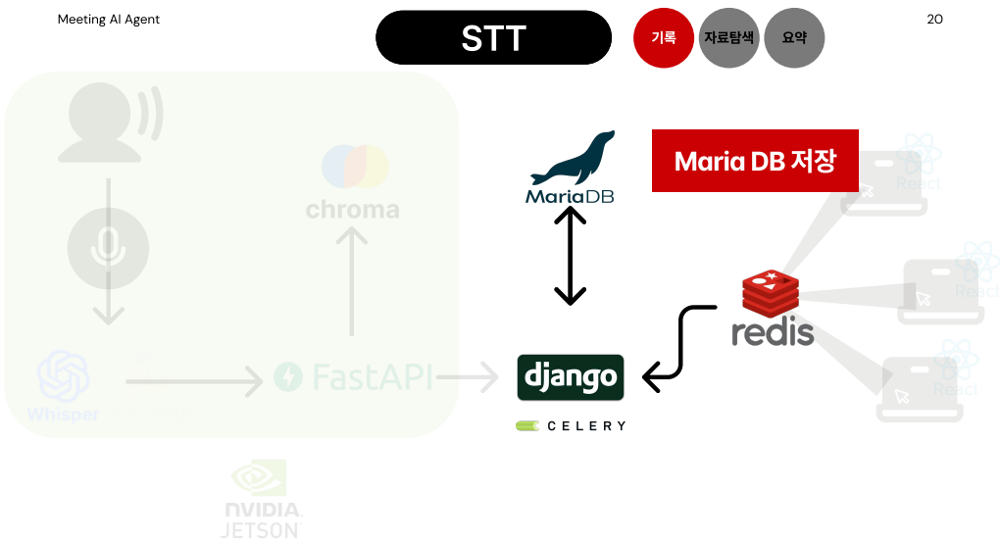
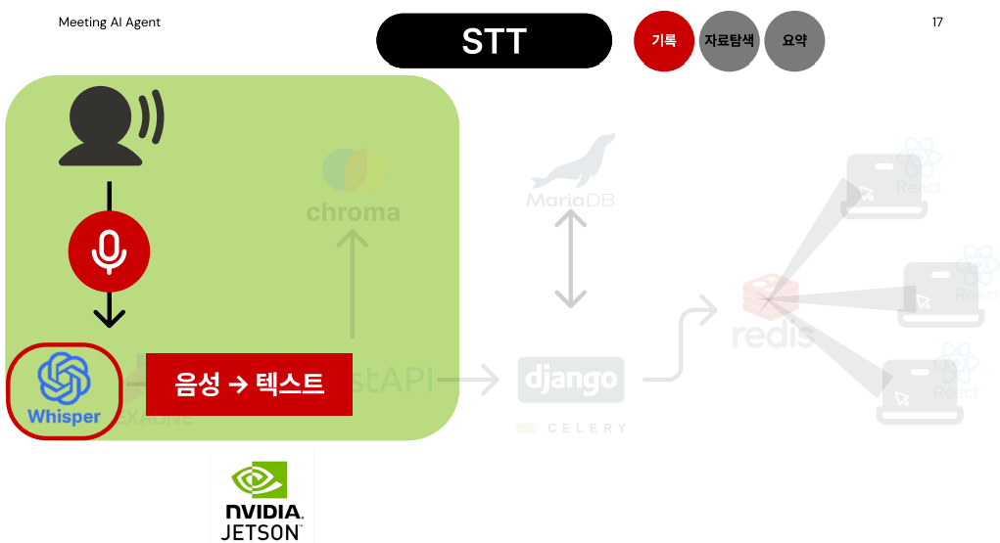
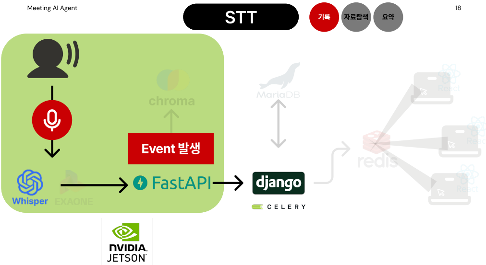
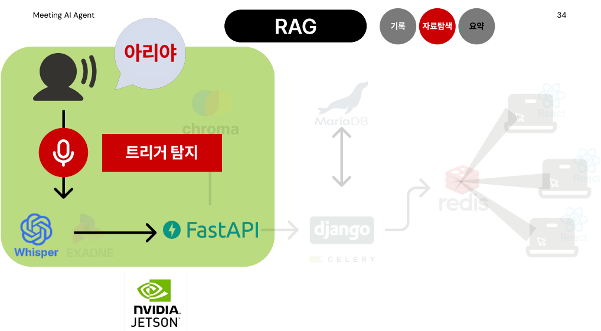
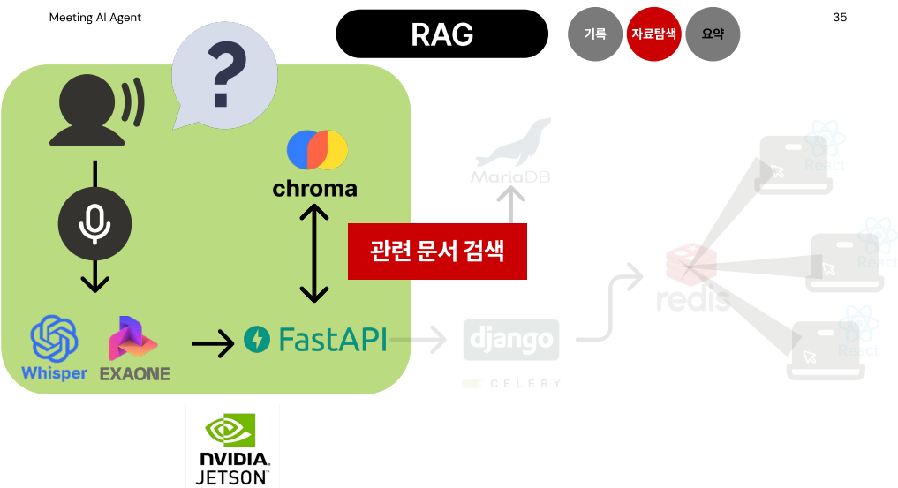
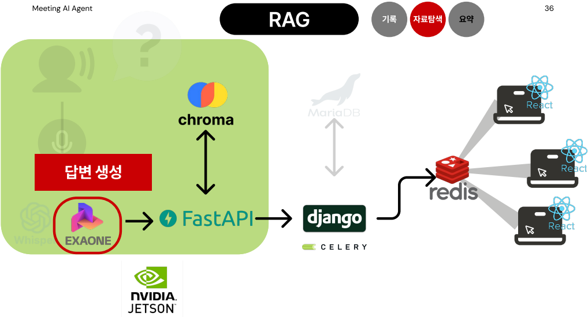
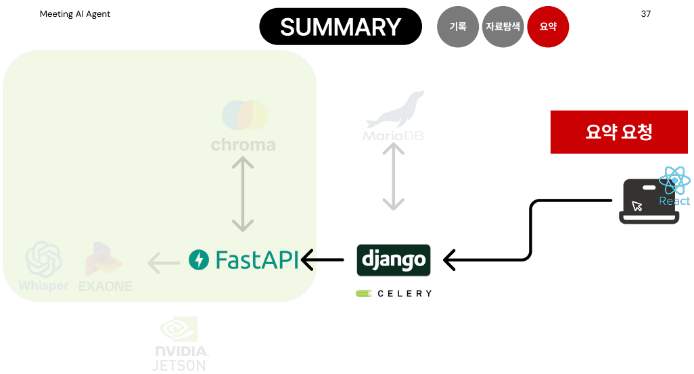
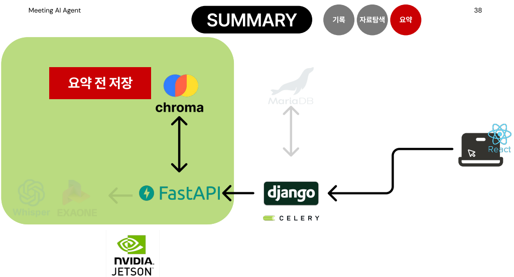
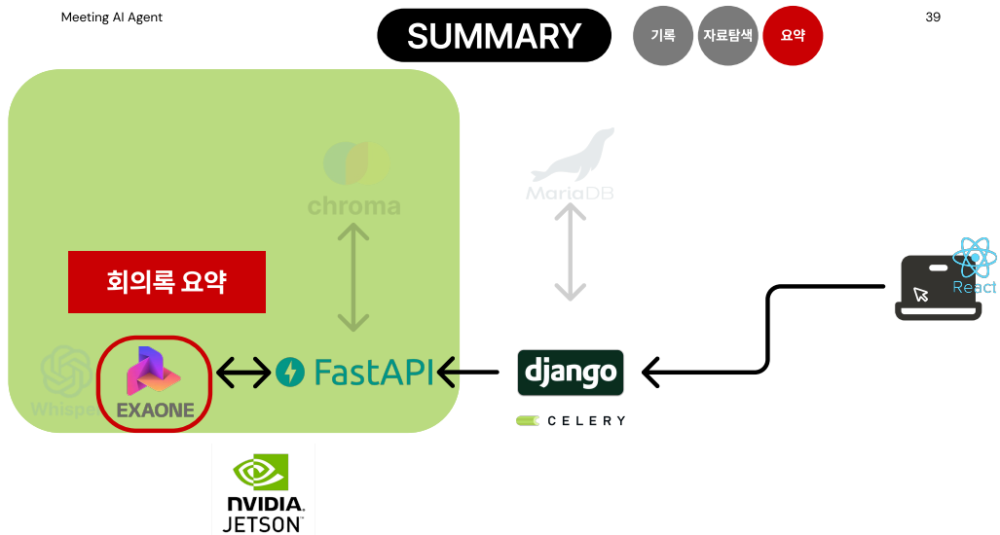

   
<br>

## 🤖 알고리즘
**1. 실시간 회의 페이지 - SSE**
-  
 
 


```python

```

**2. 회의 기록 - STT**
- 
 
 


```python

```

**3. 자료 탐색 - RAG**
- 
 
 
 

```python

```

**4. 회의록 생성- Summary**
- 
 
 
 


```python

```

<br>
